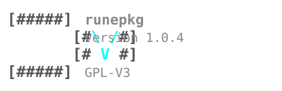

<h1>
  
  runepkg
</h1>

---

[](https://musl.libc.org/)
[](https://en.wikipedia.org/wiki/ANSI_C)
[](https://github.com/michkochris/runepkg)
[](https://isocpp.org/)
[](https://www.gnu.org/licenses/gpl-3.0)

**runepkg** is a high-performance hybrid C89/C++ package manager engineered specifically for the **Debian ecosystem**. Treating the entire Debian universe as a universal supply chain, **runepkg** enables developers to unearth and deploy `.deb` software from any Debian repository or historical archive with extreme speed and minimal overhead.

Designed with a dual-tier architecture, **runepkg** functions as an ultra-compact C89 package manager for resource-constrained embedded targets, while offering an extended C++ suite for parallel multi-threaded repository synchronization and deterministic dependency graph resolution. By intelligently pruning non-essential subtrees, recommendations, and bloat from the massive Debian dependency tree, **runepkg** streamlines installation plans and significantly outperforms `apt`.

**runas** is a dedicated Debian source package builder and toolchain forge engine—a Debian Source Mana Fiend named after *Runas the Shamed* from *World of Warcraft*. **runas** consumes upstream Debian source packages (`.dsc`, `.orig.tar`, `.debian.tar`), inspects and auto-satisfies host build dependencies, applies Debian patches, and orchestrates multi-stage source-to-binary compilation pipelines to forge fully Debian-compatible `.deb` packages directly from source.

---

> [!TIP]
> **Production Stability:** **runepkg** is declared **Stable** and battle-tested across Linux distributions. Thorough refinement across core engine workflows guarantees robust handling of dependency graphs, maintainer script execution, full system upgrades, and large-scale environment deployments in a single pass.
>
> **dpkg "Quantum Entanglement" (Native):** **runepkg** maintains native, real-time compatibility with **dpkg**. Installing or removing packages directly updates `/var/lib/dpkg/status` stanzas and generates `/var/lib/dpkg/info/*.list` files with full POSIX and Debian policy compliance, guaranteeing that `dpkg` system state remains 100% harmonized.
>
> **apt Interoperability (Conditional):** **runepkg** offers high conditional interoperability alongside **apt**. Because `apt` maintains its own isolated higher-level state cache, coexisting workflows are supported, though occasional conflict resolution (e.g., `apt --fix-broken install`) may be required depending on repository package diversions and cache states.

---

## Is runepkg Right for Me?

| Scenario | runepkg | apt | Recommendation |
| :--- | :---: | :---: | :--- |
| **Standard Debian/Ubuntu Desktop** | ✅ | ✅ | Use **runepkg** for speed or **apt** |
| **Native `dpkg` State Integration** | ✅ | ✅ | Guaranteed via `runepkg/dpkg` layer |
| **Coexistence Alongside `apt`** | ✅ | ⚠️ | High interoperability (conditional) |
| **Embedded Targets / Initramfs / CLFS** | ✅ | ❌ | Use **runepkg** (C89 minimal footprint) |
| **Deterministic High-Speed Deployment** | ✅ | ⚠️ | Use **runepkg** (parallel multi-threaded) |

---

## Architectural Separation & Toolchain Overview

The system is structured into three clear, distinct tiers to address distinct operational domains:

```text
[ User / Shell Layer ]
│
├───> [ 1. Low-Level runepkg (C89 Core) ] ──────> Fully Debian-Compatible .deb Installation, Unpacking, Removal, FNV-1a DB
│
├───> [ 2. High-Level runepkg (C++ FFI) ] ──────> Repository Sync, Parallel Downloads (libcurl), Graph Resolution
│
└───> [ 3. runas (Debian Source Forge) ] ───────> Source Fetching (.dsc/.orig), Build-Depends Verification, Fully Debian-Compatible .deb Compilation
```

### Definitive Tier Separation

- **1. Low-Level runepkg (C89 Minimal Core):** Engineered in strict ISO C89/C90 with zero external dependencies beyond `libc` (`glibc` or `musl`). It manages low-level package operations—direct installation, extraction, and removal of fully Debian-compatible `.deb` packages, maintainer script execution, and state persistence in a fast binary/FNV-1a hash database. Ideal for resource-constrained targets like initramfs, embedded hardware, and recovery media.
- **2. High-Level runepkg (Extended C++ FFI):** Built as an extended C++17 layer connected via a C FFI bridge. It provides high-level repository management—multi-threaded parallel HTTP downloads via `libcurl`, fast memory-mapped binary autocompletion, and intelligent graph resolution that prunes non-essential subtrees from the massive Debian package index to outperform `apt`.
- **3. runas (Debian Source Package & Toolchain Forge Engine):** A dedicated companion engine focused exclusively on source package ingestion and toolchain forging. Named after *Runas the Shamed* from *World of Warcraft*, `runas` ingests Debian source files (`.dsc`, `.orig.tar`, `.debian.tar`), inspects host build toolchains, automatically satisfies missing build dependencies, applies Debian patches, and executes multi-stage compilation pipelines to build fully Debian-compatible `.deb` packages directly from source.

### Architectural Comparison Matrix

| Feature | Low-Level runepkg (C89) | High-Level runepkg (C++ FFI) | runas (Source Forge Engine) |
| :--- | :--- | :--- | :--- |
| **Primary Role** | Fully Debian-Compatible `.deb` Package Management & Extraction | Repository Sync, Network Parallelism & Graph Resolution | Source Package Ingestion, Toolchain Verification & Fully Debian-Compatible `.deb` Compilation |
| **Language Standard** | ISO C89 / C90 (ANSI C) | ISO C89 + C++17 (FFI Bridge) | C++17 |
| **Binary Size** | ~417 KB (dynamic) / ~536 KB (static) | ~2.5 MB (100% self-contained static ELF) | ~2.5 MB (100% self-contained static ELF) |
| **Dependencies** | `libc` only (`musl` or `glibc`) | `libcurl`, `zlib` (or statically bundled) | `libcurl`, `zlib`, build toolchains (`gcc`, `dpkg-dev`) |
| **Core Commands** | `-i`, `-r`, `-l`, `-s`, `-L`, `-S`, `-u`, `-m`, `-b` | `update`, `upgrade`, `download-only`, `download-depends`, `search`, `info` | `sync`, `update`, `source`, `prepare`, `build`, `source-build` |
| **Target Environments** | Embedded systems, initramfs, CLFS, recovery media | Workstations, build farms, cloud instances, chroots | Debian source package compilation, toolchain forging, custom builds |

---

## The runepkg Difference

Starting from its lowest C89 core up to the C++ FFI forge, **runepkg** is engineered with a series of deliberate architectural design choices that distinguish it from traditional package management tools:

- **Cascading Configuration System (`runepkgconfig`):** Features a 4-tier layered configuration hierarchy (hardcoded system defaults, `/etc/runepkg/runepkgconfig`, user config, and CLI environment overrides) that provides complete path portability, dynamic sysroot registries, and multi-profile target support without modifying executable code.
- **Unified FNV-1a Memory Engine:** Employs a custom FNV-1a hash table with dynamic prime resizing to manage unified `PkgInfo` C structures in memory, guaranteeing minimal collision overhead, zero-wiped secure memory buffers, and ultra-fast $O(1)$ symbol lookups.
- **Hierarchical Binary Serialization (`pkginfo.bin`):** Completely eliminates the severe I/O bottlenecks of flat-file text parsing (such as standard `/var/lib/dpkg/status`) by serializing `PkgInfo` records into a structured `package-version` directory hierarchy on disk, enabling zero-copy binary indexing and instant metadata retrieval.
- **Dual-Engine Concurrency:** Pairs a multi-threaded C++ thread pool for parallel HTTP repository downloads (`libcurl`) with a C `pthread` worker pool for high-throughput payload extraction and maintainer script execution.
- **Deterministic Dependency Graph Resolution & Tree Pruning:** Intelligently prunes non-essential subtrees, documentation, recommendations, and bloat from the massive Debian dependency graph, isolating strictly required runtime libraries and build tools to produce minimal, bottom-up installation and build plans.
- **Predictive Zero-Allocation Autocompletion:** Utilizes an mmap-backed binary index (`runepkg_autocomplete.bin`) to deliver instant, zero-allocation shell suggestions across CLI flags, installed packages, and **70,000+ Debian repository packages**.
- **Security-Hardened Perimeter:** Features `secure_malloc` zero-wiping, path traversal jail protection (`..`), POSIX `rlimit` extraction bounds (preventing zip bombs), sandboxed worker privilege dropping (`_apt`), and OpenPGP `InRelease` signature verification.
- **Native Source-to-Binary Toolchain Forging (`runas`):** Seamlessly integrates the companion `runas` engine to ingest Debian source packages (`.dsc`, `.orig.tar`), inspect and auto-install host build toolchains, apply Debian patches, and compile 100% Debian-compatible `.deb` packages directly from source.

> 🎩 **Dive Deeper into the Architecture:** For a complete technical deep-dive into the FNV-1a hash engine, binary storage models, 4-stage hermetic toolchain forging, and low-level C89/C++ FFI mechanics, read the full 🎩 [DESIGN.md](./docs/DESIGN.md) specification.

---

## Host System Requirements & Dependency Mapping

**runepkg** and **runas** can be compiled on virtually any Linux distribution. Depending on whether you are building the Minimal C89 Core, the Extended C++ FFI Suite, or using **runas** for source package forging, ensure the following host packages are installed:

### Automated Setup (Debian, Ubuntu, Kali)
A modular bootstrap script is provided to automatically install required dependencies on Debian-family systems:

```bash
# Install all build dependencies (Minimal Core + Extended C++ FFI + runas)
./debian-depends.sh --all

# Or install modular profiles:
./debian-depends.sh --core      # C compiler and basic build utilities
./debian-depends.sh --extended  # C++ FFI headers, libcurl, and zlib
```

### Manual Dependency Package Mapping / Custom Linux Distributions
For users on non-Debian distributions (Fedora, Arch, Alpine, Void, Gentoo, or custom distros), install the equivalent packages using your system's package manager:

| Requirement Category | Debian / Ubuntu / Kali | Fedora / RHEL | Arch Linux / Manjaro | Alpine Linux | Generic / Custom Distro |
| :--- | :--- | :--- | :--- | :--- | :--- |
| **C/C++ Compiler & Make** | `build-essential` | `gcc`, `gcc-c++`, `make` | `base-devel` | `build-base` | Any C89 & C++17 compiler + GNU `make` |
| **HTTP Transfer Library** | `libcurl4-openssl-dev` | `libcurl-devel` | `curl` | `curl-dev` | `libcurl` development headers (`curl/curl.h`) |
| **Compression Library** | `zlib1g-dev` | `zlib-devel` | `zlib` | `zlib-dev` | `zlib` development headers (`zlib.h`) |
| **Cryptography / OpenSSL** | `libssl-dev` | `openssl-devel` | `openssl` | `openssl-dev` | OpenSSL / `libcrypto` development headers |
| **Package Configuration** | `pkg-config` | `pkgconf-pkg-config` | `pkgconf` | `pkgconf` | `pkg-config` or `pkgconf` binary |
| **Source Utilities (`runas`)**| `dpkg-dev` (optional) | `dpkg-dev` (optional) | `dpkg` (optional) | `dpkg` (optional) | `patch`, `tar`, `xz`, `gzip` (No `dpkg` required) |

> 💡 **Standalone & Independent Architecture:** Both **runepkg** and **runas** are 100% self-contained binaries featuring native `.deb` container extraction, control stanza parsing, and source archive unpacking. They do **not** require `dpkg` or `dpkg-dev` to be pre-installed on the host machine. They operate completely independently on non-Debian distributions, embedded systems, or custom Linux builds while remaining 100% harmonized with native `dpkg` state formatting.

## Installation & Build Instructions

> [!NOTE]
> **Source Directory Navigation:** The top level of the repository contains project documentation and licensing. Before executing configuration, build, or installation commands, navigate into the source code directory:
> ```bash
> cd runepkg/runepkg
> ```

### 1. Pre-Build Configuration Customization (`runepkgconfig`)
Before compiling or installing **runepkg**, you can customize default workspace paths, installation target roots, and repository mirrors directly in `runepkgconfig`:

```bash
# Edit the configuration template before building
nano runepkgconfig
```

Key configurable defaults include:
- `runepkg_dir`: Base data directory (defaults to `/srv/lib/runepkg_dir`).
- `install_dir`: Package installation target root (set to `/` for system-wide installation, or `/srv/lib/runepkg_dir/install_dir` for isolated sandboxes).
- `runepkg_db`: State database path (`/srv/lib/runepkg_dir/runepkg_db`).
- `dpkg_host`: Quantum entanglement mode with host `dpkg` (`auto` or `none`).
- `deb` / `deb-src`: Target Debian/Kali repository mirrors.

> 💡 **Automatic Configuration Deployment:** During `sudo make install` (or `sudo make install-runas`), the Makefile automatically copies your customized `runepkgconfig` to `/etc/runepkg/runepkgconfig`. Customizing `runepkgconfig` **before** building ensures your preferred default paths, sandbox targets, and mirrors are deployed as the active system-wide configuration immediately upon installation.

### 2. Custom Compiler Selection
Select your preferred C and C++ compiler environment variables before running build targets:

```bash
# Select custom compiler (e.g., Clang)
export CC=clang
export CXX=clang++
```

### 3. Developer Clean Reset & Uninstallation
To perform a complete workspace purge and uninstall binaries, configuration files, and state directories:

```bash
# Clean build artifacts and uninstall binaries
make clean && sudo make uninstall

# Purge developer workspace directories and cached state
sudo rm -rf /srv/lib/runepkg_dir /var/lib/runepkg_dir
```

### 4. Embedded Minimal Installation (C89 Core Only)
For embedded hardware, initramfs, CLFS, or recovery media, compile the ultra-compact, zero-dependency ISO C89 core (~417 KB) requiring only standard `libc`:

```bash
# Build and install Minimal C89 Core
make clean && make runepkg && sudo make install

# Uninstall Minimal Core
sudo make uninstall
```

### 5. Full Extended C++ FFI Suite Build (`make all`)
For desktop, workstation, build farm, or server environments, compile the full high-performance suite featuring `runepkg` with C++ FFI network parallelism and the `runas` source forge engine:

```bash
# Build and install Full Extended Suite (runepkg + runas)
make clean && make all && sudo make install && sudo make install-runas

# Uninstall Full Extended Suite
sudo make uninstall
```

### 6. Indestructible Static musl-libc Builds (`make musl-all`)
For hermetic, distribution-agnostic deployment, compile 100% self-contained static binaries with bundled dependencies:

```bash
# Build and install 100% Self-Contained Static ELFs (runepkg + runas)
make clean-all && make musl-all && sudo make install && sudo make install-runas

# Minimal C89 Static Binary
make clean && make MUSL=1 LDFLAGS="-static" runepkg && sudo make install
```

> 🏆 **The Holy Grail of Systems Programming:** `make musl-all` fetches an isolated `musl` toolchain and compiles `libcurl` and `zlib` from source, producing an indestructible static package manager binary that runs across any Linux distribution with zero shared library dependencies. For an in-depth guide on static musl deployment, see 🏆 [HOLY_GRAIL.md](./docs/HOLY_GRAIL.md).

---

## ⚡ Setting Up Lightning-Fast Shell Autocompletion

Both **runepkg** and **runas** feature mmap-backed $O(1)$ predictive shell autocompletion across CLI flags, subcommands, installed packages, and over **70,000+ Debian repository packages**.

To enable instant bash autocompletion for both tools, add the following completion hooks to your `~/.bashrc`:

```bash
# Enable runepkg bash completion
complete -o nospace -C runepkg runepkg

# Enable runas bash completion
complete -o nospace -C runas runas
```

Reload your shell configuration to activate:

```bash
source ~/.bashrc
```

---

## Workspace Directory Hierarchy (`/srv/lib/runepkg_dir/`)

```text
/srv/lib/runepkg_dir/
├── runepkg_db/
│   ├── pkginfo/                  # Hierarchical installed package metadata
│   ├── runes_graph.bin           # Serialized repository dependency graph
│   ├── runes_host.bin            # Synced host dpkg status snapshot
│   ├── repo_index.bin            # Binary package metadata cache
│   └── runepkg_autocomplete.bin  # Memory-mapped autocompletion index
├── build_dir/                    # Source workspaces and unpacked packages
├── download_dir/                 # Cached .deb downloads
└── install_dir/                  # Package installation root (defaults to /)
```

---

## 📖 CLI Usage & Command Reference

### ⚡ runepkg (Fast & Efficient Debian Package Manager)

```text
Usage:
  runepkg <COMMAND> [OPTIONS] [ARGUMENTS]

Core Package Management (Local / Low-Level):
  sync                                    Synchronize host package database with system state.
  -i, --install <deb|pkg>...              Install .deb files or repository packages.
      --install -                         Read .deb paths from stdin.
      --install @file                     Read .deb paths from a list file.
  -u, --unpack <package.deb> [dest_dir]   Unpack a .deb into control_dir workspace;
                                          optionally extract install files to destination directory.
  -r, --remove <package-name>             Remove an installed package.
      --remove -                          Read package names from stdin.
      --remove @file                      Read package names from a list file.
  -l, --list [pattern]                    List installed packages (optionally matching pattern).
  -s, --status <package-name>             Show detailed info about an installed package.
  -L, --list-files <package-name>         List all files owned by an installed package.
  -S, --search <file-path>                Search installed packages for a specific file.
  -m, --md5check <package-name>           Verify MD5 checksums of an installed package.
  -b, --build [dir] [output.deb]          Build a .deb from a directory structure.
  -v, --verbose                           Enable verbose output (detailed logging).
  -d, --debug                             Enable debug output (developer traces).
  -f, --force                             Force install/upgrade despite missing dependencies.
      --version                           Print version and license information.
  -h, --help                              Display this help message.

Advanced Repository Management (Network / C++ FFI):
  update                                  Sync metadata and check for upgradable packages.
  upgrade                                 Download and install all available upgrades.
  search <pkg|pattern>                    Search repositories for packages or patterns.
                                          (Use "quotes" to search for multiple words).
  info <pkg>...                           Show repository information for a package.
  depends, resolve-tree <pkg>             Recursive ASCII tree visualization of target depends.

Download Utilities:
  download-only <pkg>...                  Download a .deb to download_dir without dependencies.
  download-depends <pkg>...               Download a .deb and its binary dependencies.
  download-build-depends <pkg>...         Download binary .debs required to build a source package.

Maintenance & Diagnostics:
      --print-config                      Print all active path and repository settings.
      --print-config-file                 Show the path to the runepkgconfig file in use.
      --print-pkglist-file                Show paths to the autocomplete index files.
      --print-autopool                    Print the contents of the consolidated autocomplete pool.
      --rebuild-autocomplete              Rebuild the local package name index.
  transactions [list|inspect <ts|log>]   Audit FSM execution logs, inspect journals, or recover crashed runs.
                                          Accepts a timestamp or absolute path to a .log file.
                                          Guarantees atomic state and system integrity by tracking
                                          transactional boundaries from start to finish.
  verify <pkg>                            Cryptographic package verification using GPG.
```

### 🧙 runas (High-Performance Debian Source Package & Toolchain Forge Engine)

```text
Usage:
  runas <COMMAND> [OPTIONS] [ARGUMENTS]

Source Forging & Toolchain Pipeline Commands:
  runas sync                               Synchronize host package database snapshot
  runas update                             Download repository indices & update binary graphs
  runas source <package>                   Download Debian source package files (.dsc, .orig, .debian)
  runas prepare <package>                  Unpack source rune, apply Debian patches (*), & fix timestamps
  runas source-depends <pkg>               Download complete source runes for package and runtime dependencies
  runas source-build-depends <pkg>         Download complete source runes for package and build dependencies
  runas depends <package>                  Render recursive ASCII dependency tree of target package
  runas resolve-tree <package>             Resolve target dependency graph for source building
  runas build <package|dsc> [subpkg|help]  Verify host tools and build primary package (or subpackage/help)
  runas buildpkg-split <package>           Build source package and split into all subpackages
  runas source-build <package>             3-Stage Pipeline: fetch runes -> verify host tools -> build .deb
  runas autocomplete <query>               Run $O(1)$ memory-mapped binary autocomplete lookup

Multi-Arch Options:
  --arch=<target_arch>                     Specify target Multi-Arch architecture (amd64, arm64, riscv64, etc.)
```

---

## Documentation & References

- 🎩 [DESIGN.md](./docs/DESIGN.md): Detailed architectural design choices and performance engineering.
- 💻 [CPP.md](./docs/CPP.md): C++ FFI bridge specification and memory management.
- 🧪 [TESTING.md](./docs/TESTING.md): Integration test suites and fuzzing campaign methodologies.
- 🏆 [HOLY_GRAIL.md](./docs/HOLY_GRAIL.md): Statically-linked musl build guide.
- 🛡️ [COPILOT.md](./docs/COPILOT.md): Security review and architectural assessment.

---

## Philosophy & Contact

*Built with ❤️ for the GNU/Linux community. **runepkg** treats packages as building blocks rather than strict system policies, allowing power users to build and deploy `.deb` packages exactly as they wish.*

Developed from years of experience with Custom Cross Linux From Scratch (CLFS), **runepkg** views `.deb` packages as "runes"—valuable software building blocks. This tool empowers you to unearth and deploy software safely and efficiently.

<p align="left">
  
</p>

🍆 [michkochris@gmail.com](mailto:michkochris@gmail.com) | [runepkg@gmail.com](mailto:runepkg@gmail.com)
